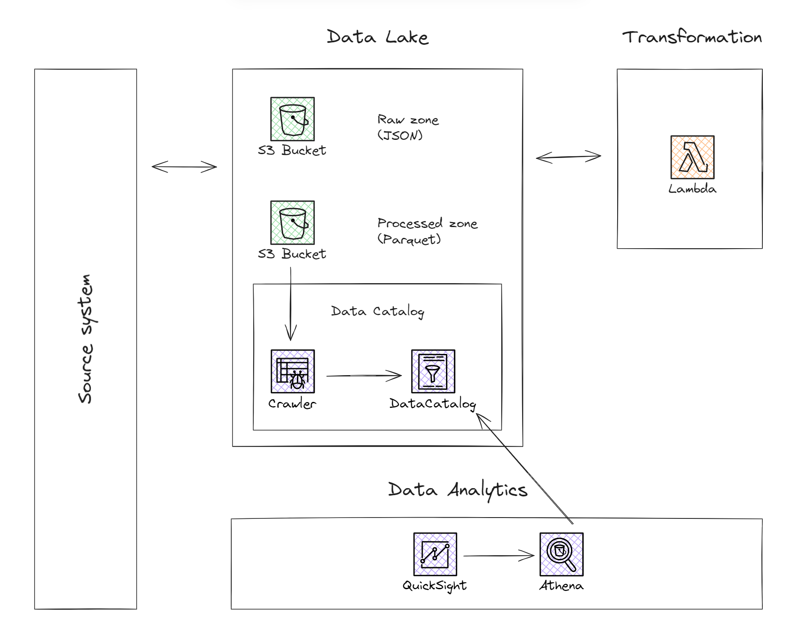

# Requirements

- Data Analyst wants to analyze data from the JSON files stored on the AWS S3 bucket.
- Data Engineer transforms the original JSON files into a columnar and compressed Parquet format using the AWS Lambda Service. The JSON structure is flat.
- The Parquet files are partitioned by date because the Data Analyst wants to query data by date.
- File names are in format "data_YYYY_MM_DD.json".
- Files can be updated or deleted.

# Architecture

